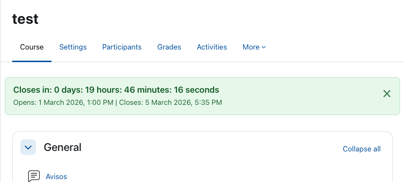
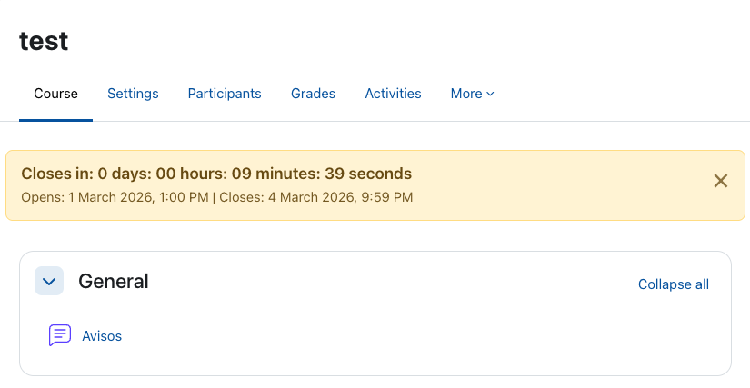
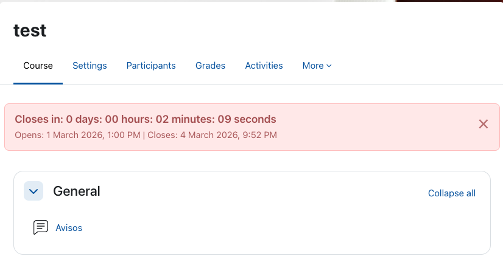
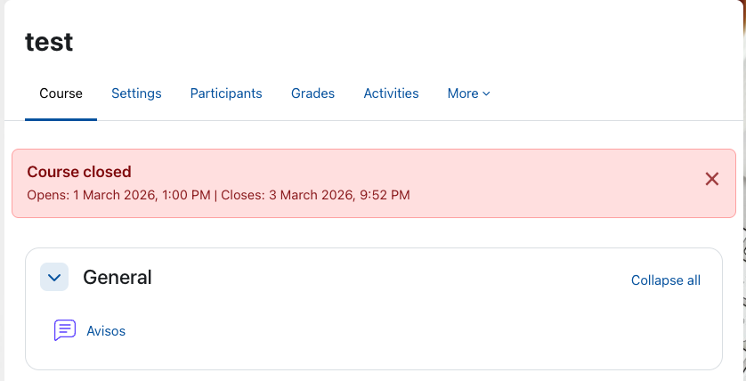

# local_coursecountdown

`local_coursecountdown` is a Moodle local plugin that displays a countdown bar in course pages.

The bar shows:

- Course start date/time (`startdate`)
- Course end date/time (`enddate`)
- Countdown to opening or closing time (human-readable format)

Color rules:

- Green by default
- Yellow when 30 minutes or less remain
- Red when 5 minutes or less remain (with blink effect)

## Edition

- Edition: Free (no admin settings page)
- Release: `0.2.0-free`

## Author

- Name: Antonio Jimenez
- Email: antoniomexdf@gmail.com
- GitHub: https://github.com/antoniomexdf-boop

## Installation

1. Copy this folder to `moodle/local/coursecountdown`.
2. Log in as admin and complete the plugin installation/upgrade flow.
3. Purge caches from `Site administration > Development > Purge all caches`.

## Notes

- The plugin is shown on course pages (not on the site home page).
- If both course dates are missing, the bar is still shown with the "No configured dates" message.
- Dates are formatted using Moodle user locale/timezone settings.
- This free edition does not create a settings page in `Site administration > Plugins > Local plugins`.

## Screenshots

